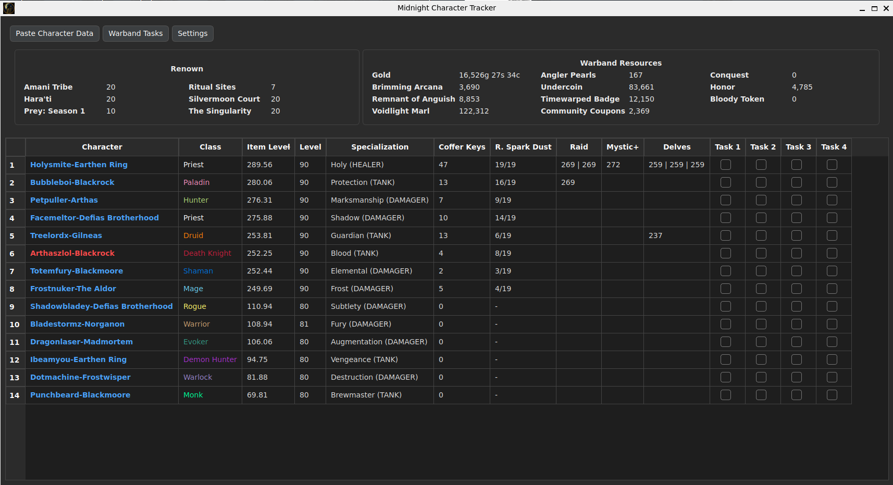
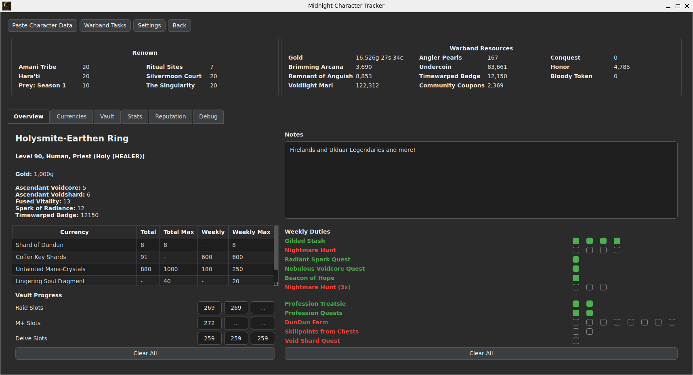
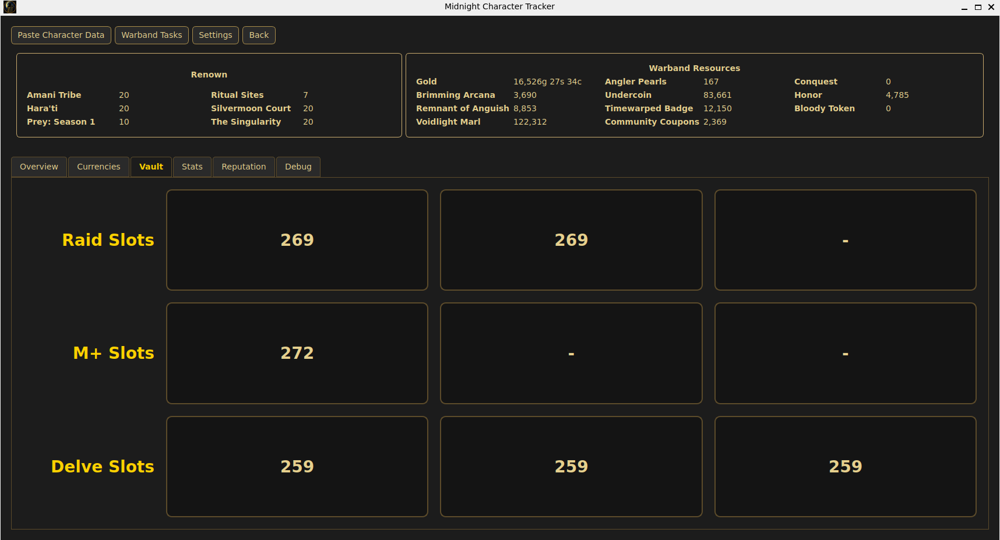
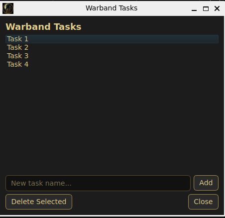
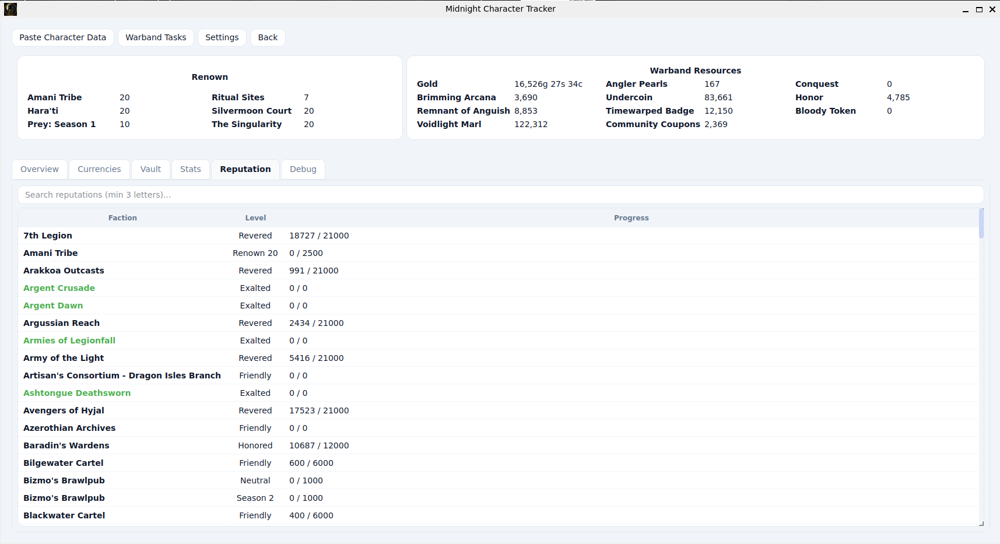
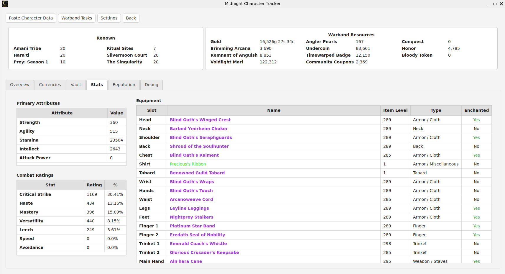

# Warband Manager

A desktop companion for **World of Warcraft** players that helps track character progress, currencies, Great Vault rewards, weekly activities, notes, and warband-wide tasks.

Warband Manager combines imported character data with user-managed tracking features and provides a clean overview of your entire roster in a single application.

  

The character data export needs to be done with the Addon CharacterExport , which can be downloaded here: [https://www.curseforge.com/wow/addons/characterexport](https://www.curseforge.com/wow/addons/characterexport)

(The Addon CharacterExport is NOT created or maintained by me! Kudos to the Author Sitttar for his work.)

Recommanded settings for the Addon Export:

Check these boxes: 

- Bags
- Bank
- Character Stats
- Currencies
- Equipment
- Location
- Progress
- Reputations

(checking the other boxes will grow the export significantly while no data is used by Warband Manager)

## For Testers not playing WoW retail:

Please check the user guide for information on how to handle the test data. The guide can be found here: /docs/user-guide

---

## Features

### Character Management

- Import character exports directly from within the application
- Manage multiple characters across realms
- Automatic character updates
- Character deletion support
- Preserves user data across imports

### Character Overview

- Character summary view
- Currency tracking
- Reputation overview
- Statistics and debug information
- Dedicated currency tab

### Notes

Maintain personal notes for each character:

- Upgrade plans
- Profession goals
- Raid preparation
- Reminders

### Weekly Duties

Track recurring weekly activities with simple checklists.

### Great Vault Progress

Record and track Great Vault progress directly inside the application.

Vault progress is preserved between character imports.

### Warband Tasks

Manage tasks that span multiple characters:

- Weekly objectives
- Collection goals
- Event preparation
- Personal reminders

### Themes

Includes multiple visual themes that can be switched at runtime.

---

## Screenshots

### Main Window with Character List (Dark Theme)

  

### Character Overview (Dark Theme)

  

### Vault Tracking (WoW Theme)

  

### Warband Tasks (WoW Theme)

  

### Reputations Tab (Modern Theme)

  

### Stats and Equipment (Light Theme)

  

---

## Installation

### Windows

Download and run:

MidnightCharacterTrackerSetup.exe

The installer will guide you through the installation process.

### Linux

There is currently no packaged Linux release.

1. Download or clone the GitHub repository.
2. Create and activate a Python virtual environment.
3. Install the required dependencies.
4. Run the application from the project directory.

Example:

bash:
git clone [https://github.com/sweenyHH/warband-manager](https://github.com/sweenyHH/warband-manager)
cd midnightchartracker

python3 -m venv venv
source venv/bin/activate

pip install -r requirements.txt (or requirements-dev.txt)
python main.py

---

## Importing Character Data

1. Open Warband Manager
2. Click **Paste Character Data**
3. Paste your exported character data
4. Save the import

Existing characters are updated automatically while preserving:

- Notes
- Weekly Duties
- Great Vault Progress

---

## Data Storage

All data is stored locally on your computer.

This includes:

- Character exports
- Notes
- Weekly Duties
- Great Vault Progress
- Warband Tasks
- Application settings

No online account or cloud service is required.

---

## Built With

- Python
- PySide6
- PyInstaller

---

## Project Status

Warband Manager is actively maintained and used with real character data.

For the near future, an extended version of Warband Manager will be released, supporting Exports from French and German WoW Clients.

Bug reports, suggestions, and feedback are welcome.

---

## Documentation

Additional project documentation can be found in:

docs/

---

## License

Warband Manager is distributed under a custom source-available license.

See the LICENSE file for details.